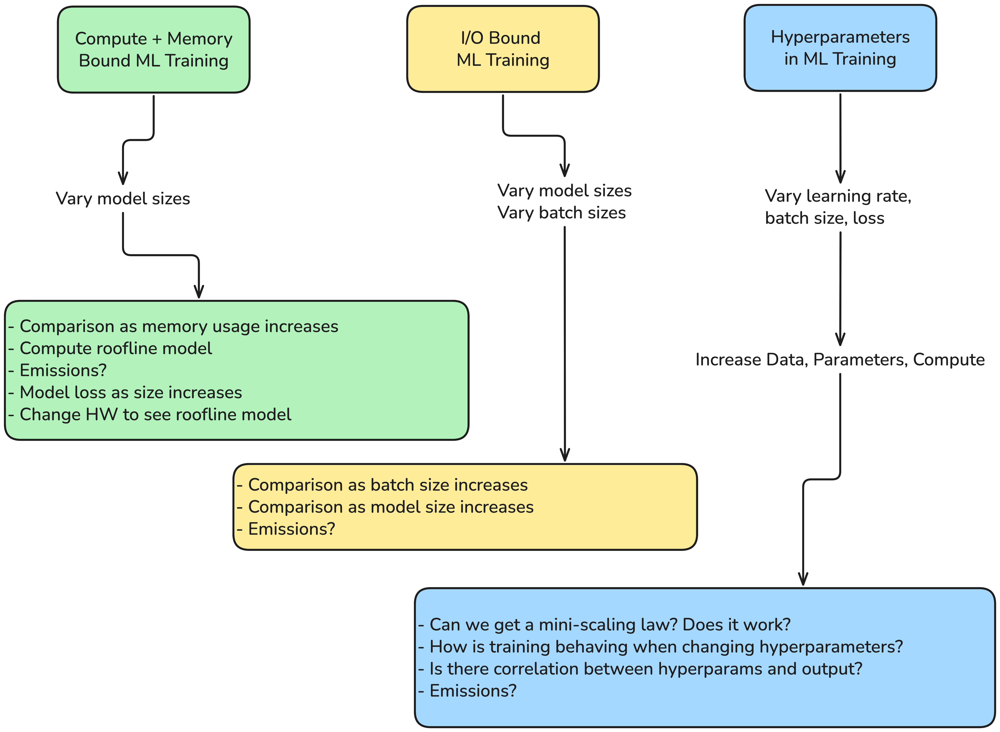
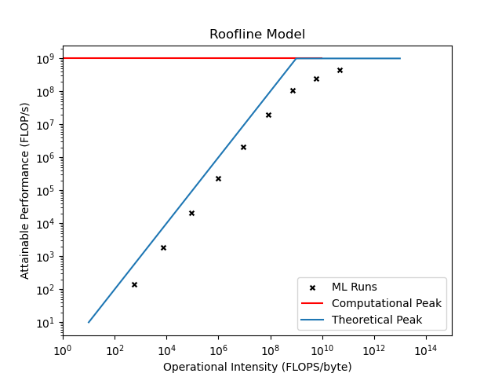
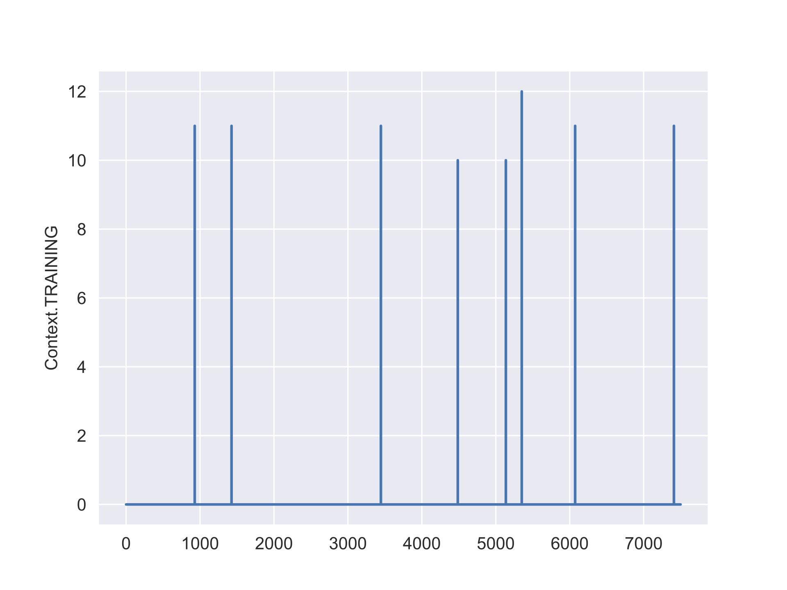

# FBK Benchmarks



## Summary 

| Benchmark | Model Type | Resource | Why |
| - | - | - | - |
| **Compute-memory-bound** | Very deep MLP | Compute / FLOPs | Large dense layers + Small dataset |
| **I/O-bound** | Small CNN + heavy augmentation | Disk + CPU | Slow transforms + Small batches |

## Use case 1: Compute-Memory bound ML training



## Use case 2: I/O bound ML training

| GPU usage | Memory usage |
| - | - |
|  |  |

## Use case 3: Simple ML training

## Setup

```bash
pip install -r requirements.txt
```

General folder creation

```bash
python src/preprocess/setup.py
```

Create the MNIST I/O dataset by running: 

```bash
python src/preprocess/create_MNIST_ds.py
```